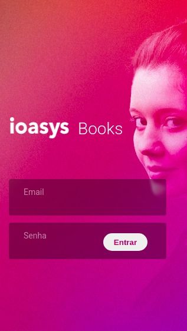
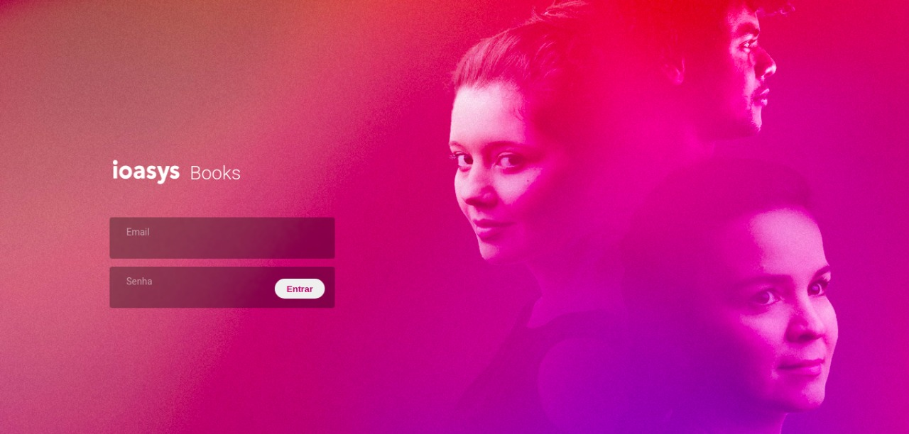
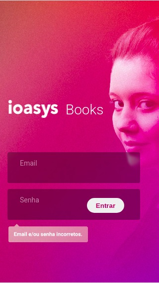
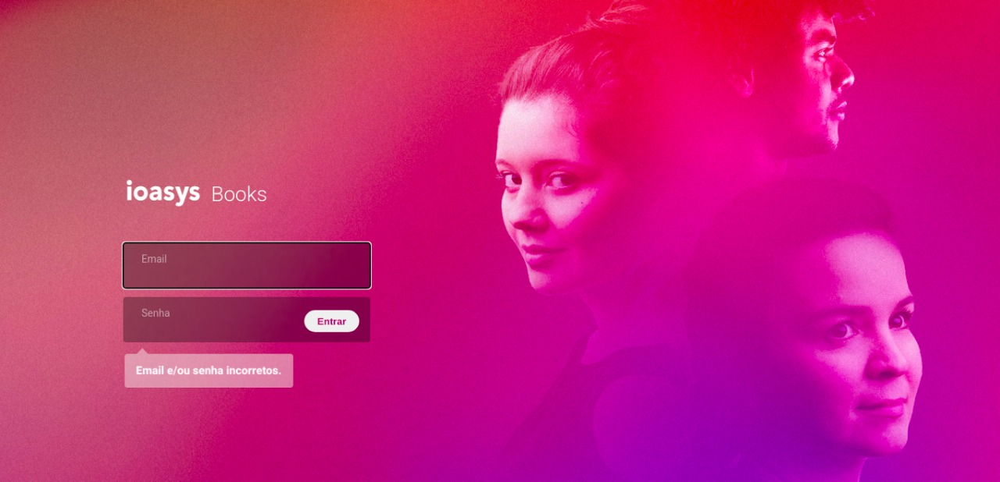
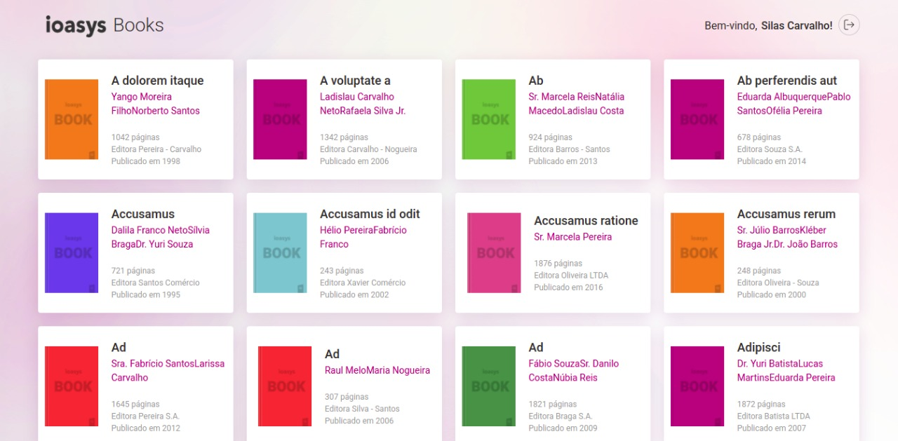
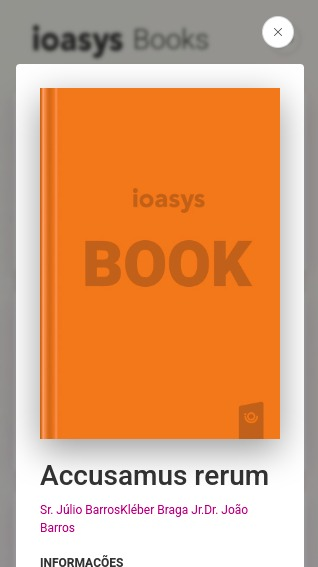
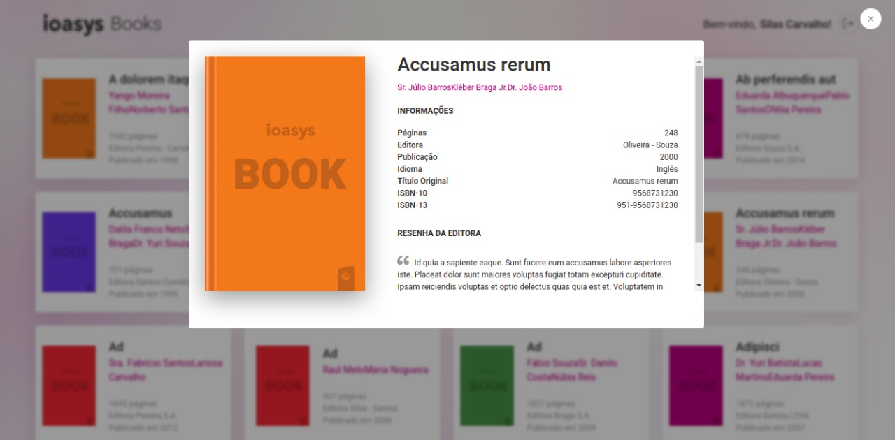

# Desafio Ioasys Books

Projeto criado para o processo seletivo para desenvolvedor front-end da Ioasys, construído em React e TypeScript.

## Visualização

"""link"""

## Login para teste

E-mail: desafio@ioasys.com.br

Senha: 12341234

## Telas criadas

1 - Login (mobile e desktop)

2 - Dashboard (mobile e desktop)

3 - Modal para visualização dos dados de cada livro individualmente (mobile e desktop)

## Ferramentas utilizadas

1 - Styled-components

2 - Axios

3 - React-router-dom

4 - React-hook-from

5 - Yup

6 - ContextAPI

7 - Prettier

8 - Vercel

## Instalação

> git clone https://github.com/emilyregolao/desafio-books-frontend.git
>
> cd desafio-books-frontend
>
> yarn install
>
> yarn start
>
> Visualização em localhost:3000

## Demonstração

### Tela de login - mobile

### Tela de login - desktop

### Erro tela de login - mobile

### Erro tela de login - desktop

### Dashboard - mobile

### Dashboard - desktop

### Modal - mobile

### Modal - desktop

